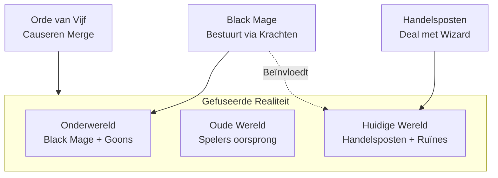
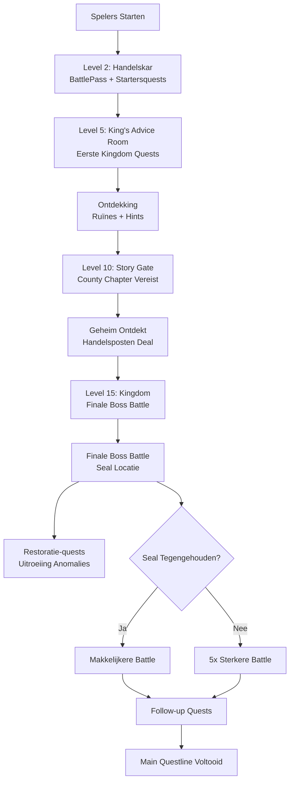
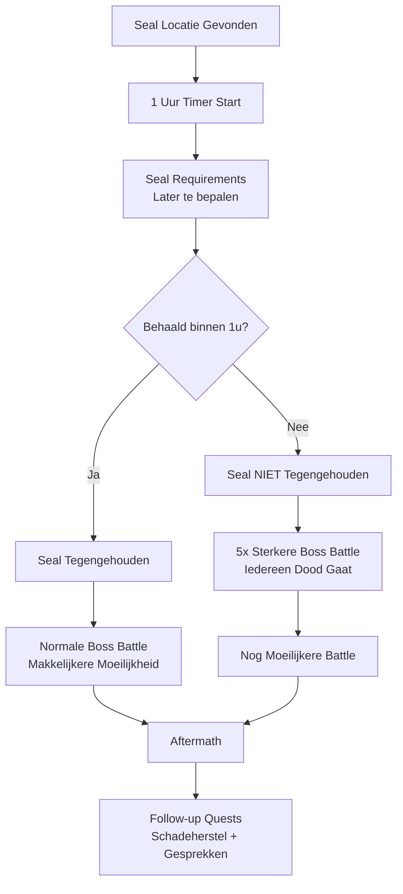

# Kingdom Quest – Storyline / World Main Idea

Dit document beschrijft de volledige storyline en wereld-lore voor Kingdom Quest. Het dient als referentie voor het team bij het uitwerken van quests, NPC-dialogen en world-building.

---

## Hoofdverhaal – Overzicht

Door de tijd heen zien spelers **anomalies** van een **Seal** die opengaat, en een **Black Mage/Wizard** die probeert te ontsnappen met zijn corrupte krachten. De wizard bestuurt dingen op de map via zijn krachten omdat hij zelf nog niet volledig van achter de seal uitkomt.

**3 werelden zijn samengevoegd** in één realiteit:
- **Onderwereld:** Waar de Black Mage/Wizard en zijn goons vandaan komen (goons waren ooit normale mensen, nu betoverd)
- **Oude wereld:** Waar de huidige spelers vandaan komen; ze waren onwetend van wat er gebeurde
- **Huidige wereld:** Waar de handelsposten staan en enkele ruïnes van de Black Mage's onderwereldse krachten

**De Orde van Vijf** (5 heroes/resistance) zaten in de onderwereld en hebben ervoor gezorgd dat de 3 werelden gefuseerd zijn om de beschaving te redden — anders was de hele wereld kapot en was het plan van de wizard gelukt.

**De handelsposten** (Noordhaven en Zuidmarkt) hebben overleefd omdat ze een deal hebben gemaakt met de wizard — ze handelen voor hem, maar dit is een geheim dat alleen de eigenaren kennen.

**Finale boss battle:** Spelers komen bij de originele seal-locatie terecht (lang verborgen, locatie onbekend). Het hele Kingdom moet binnen 1 uur veel requirements behalen om de seal tegen te houden. Als de seal niet tegengehouden wordt, volgt er een enorme boss battle waarbij iedereen dood gaat die probeert iets te doen, gevolgd door een nog moeilijkere battle.

---

## Kernpersonages & Entiteiten

### Black Mage / Wizard

- **Status:** Oude, verzegelde antagonist (eeuwen/millennia geleden verzegeld)
- **Oorspronkelijk plan:** De wereld kapot maken
- **Huidige situatie:** Bestuurt dingen op de map via zijn krachten omdat hij zelf nog niet volledig van achter de seal uitkomt
- **Goons:** Betoverde mensen (NPCs), ooit normale mensen zoals de spelers; permanent corrupt (kunnen niet bevrijd worden)
- **Naam/titel:** Nog te bepalen (bijv. "De Zwarte Tovenaar", "De Verzegelde", "Malachar de Verderver")

### De Orde van Vijf (5 Heroes / Resistance)

- **Status:** Nog in leven, maar niemand weet het
- **Oorsprong:** Zaten in de onderwereld; hebben de 3-werelden merge veroorzaakt om beschaving te redden
- **Terugkeer:** Komen terug op het einde van de storyline
- **Introductie:** Spelers leren over hen via:
  - Ruïnes met kleine hints (geschriften, standbeelden, artefacten)
  - Handelsposten questline (NPCs vertellen verhalen of hebben documenten)
  - Vertakkingen (bijv. "Verlaten locatie/gevaar" questlijn)
- **Rollen (abstract, namen worden nooit vermeld voor mysterieuze feeling):**
  - **De Leider:** Een nobody die de groep leidt
  - **De Ex-Koning:** Was ooit koning van een empire
  - **De Ex-Handelsmeester:** Was handelsmeester van de grootste bank ter wereld
  - **De Culturele:** Zeer cultureel persoon die veel met verschillende culturen bezig was
  - **De Nerd:** De nerd die alle feitjes wist over alles; onthield het meeste

### Handelsposten Eigenaren

#### Noordhaven Handelsmeester

- **Persoonlijkheid:** Stubborn, stoer, kordaat, bruut
- **Geheim:** Weet van de deal met de wizard; probeert Zuidmarkt handelsmeester te stoppen wanneer die te veel zegt
- **Rol in story:** Houdt het geheim; probeert te voorkomen dat spelers de waarheid ontdekken

#### Zuidmarkt Handelsmeester

- **Persoonlijkheid:** Losser in de omgang, altijd optimistisch en blij om je te zien
- **Geheim:** Weet van de deal met de wizard
- **Rol in story:** Laat per ongeluk het geheim los over de wereld-merge; Noordhaven handelsmeester is net niet op tijd om hem de mond te snoeren; spelers ontdekken zo dat de havemeesters beïnvloed worden door de Black Mage
- **Na onthulling:** Wordt gepakt door de Black Wizard
- **Vervanger:** Een rechterhand die altijd in de buurt is geweest neemt het leiderschap van Zuidmarkt over

### Goons (Betoverde Mensen)

- **Type:** NPCs (geen spelers)
- **Oorsprong:** Ooit normale mensen zoals de spelers; nu betoverd door de Black Mage
- **Status:** Permanent corrupt (kunnen niet bevrijd worden)
- **Locatie:** Verschillende locaties op de map, gestuurd door de Black Mage

---

## Wereld & Locaties

### 3 Werelden Gefuseerd

De realiteit zelf is gefuseerd — dit is geen fysieke samensmelting van continenten, maar een magische fusie van werelden:

1. **Onderwereld**
   - Black Mage/Wizard en goons komen hier vandaan
   - Bron van corruptie en anomalies

2. **Oude Wereld (waar spelers vandaan komen)**
   - Spelers waren onwetend van wat er gebeurde
   - Enige wereld met nog hoop op verder leven
   - Geselecteerd door de Orde van Vijf om deel uit te maken van de merge

3. **Huidige Wereld (waar spelers nu zijn)**
   - Handelsposten (Noordhaven, Zuidmarkt) — overleefd omdat eigenaren deal hebben gemaakt
   - Ruïnes van Black Mage's onderwereldse krachten
   - Locatie waar de 3 werelden nu samenkomen

### Seal-locatie

- **Status:** Lang lang verborgen; locatie onbekend
- **Onthulling:** Magisch verborgen, verschijnt pas bij bepaalde voorwaarden; wordt later in de story onthuld
- **Finale:** Hier vindt de finale boss battle plaats

### Handelsposten

- **Noordhaven:** Eén van de twee handelsposten
- **Zuidmarkt:** Eén van de twee handelsposten
- **Overleving:** Hebben overleefd omdat eigenaren een deal hebben gemaakt met de wizard
- **Geheim:** Alleen de eigenaren weten van de deal; spelen het spel mee alsof ze even verbaasd zijn als anderen

### 13 Caves

- **Aantal:** 13 verschillende type caves op de map
- **Ontdekking:** Verborgen — spelers moeten ze ontdekken via exploratie
- **Monsters:** Elke cave heeft een uniek type monsters (van de onderwereld, gestuurd door de Black Mage)
- **Doel:**
  - **Runes farmen** (voor Runes levels)
  - **XP verzamelen** (voor Runes levels)
  - **Resources verzamelen**
  - **Quest-objectives:** Specifieke beesten killen die alleen in bepaalde caves te vinden zijn
- **Monster types:** Uniek per cave (elk cave heeft eigen monster-soort)
- **Runes levels:** Kingdom-bonussen/upgrades (niet individueel speler-systeem)

**Open vragen:**
- Welke 13 monster types precies? (namen, uiterlijk, gedrag)
- Zijn caves eenmalig of herhaaldelijk bezoekbaar?
- Worden caves geleidelijk onthuld (naarmate story/levels vorderen) of zijn ze allemaal direct vindbaar?
- Hoe moeilijk zijn de caves? Schalen ze mee met Kingdom level of zijn ze fixed?
- Wat zijn concrete voorbeelden van Runes-bonussen/upgrades?

---

## Timeline & Story-structuur

### Anomalies

- **Trigger:** Getriggerd door **Staff & events** OF in **bepaalde quests** (niet door Kingdom-milestones of corruption meters)
- **Verschijning:** Door de tijd heen zien spelers anomalies van de Seal die opengaat
- **Effect:** Black Mage probeert te ontsnappen en bestuurt dingen op de map
- **Implementatie:** Staff kan anomalies handmatig triggeren via events, of ze worden automatisch getriggerd tijdens specifieke quests in de storyline

### Story Gates

- **Level 5 (Town):** Eerste echte Kingdom Quest (King's Advice Room) → introductie van de wereldproblemen
- **Level 10 (County):** Verplicht Kingdom Storyline tot County-chapter uitgespeeld om naar level 11 (March) te kunnen
- **Level 15 (Kingdom):** Finale boss battle bij seal-locatie
- **Na Level 15:** Restoratie-quests en andere kleinere uitroeiing van overgebleven anomalies

### Meerdere Boss Battles

- **Niet alleen aan het einde:** Kleinere battles tijdens de story
- **Finale:** Grote boss battle aan het einde bij de seal-locatie

### Spelers Ontdekken de Story

**Progressieve onthulling:**
1. **Ruïnes:** Kleine hints over de Orde van Vijf en de geschiedenis
2. **Handelsposten questline:** Meer informatie via NPCs en documenten
3. **Zuidmarkt handelsmeester:** Laat per ongeluk het geheim los over de wereld-merge
4. **Plot twist:** Spelers ontdekken dat havemeesters beïnvloed worden door de Black Mage
5. **Seal-locatie:** Wordt later in de story onthuld
6. **Orde van Vijf:** Komen terug op het einde

---

## Finale Boss Battle Mechanica

### Server-wide Event

- **Deelnemers:** Alle Kingdoms moeten deelnemen
- **Locatie:** Originele seal-locatie (lang verborgen, nu onthuld)

### Seal Requirements (1 uur tijd)

**Nog niet aan de orde:** Seal requirements worden later bepaald. Dit is pas voor later in de ontwikkeling.

### Twee Uitkomsten

#### Seal TEGENGEHOUDEN (binnen 1 uur)

- **Resultaat:** Makkelijkere eindbattle
- **Boss battle:** Normale moeilijkheid
- **Follow-up:** Na de battle volgen follow-up quests

#### Seal NIET tegengehouden (na 1 uur)

- **Resultaat:** Boss battle 5x sterker
- **Boss battle:** Enorme battle waarbij iedereen dood gaat die probeert iets te doen
- **Daarna:** Nog moeilijkere battle
- **Follow-up:** Follow-up quests om schade recht te zetten en met belangrijke personen praten

**Boss Battle Scaling:** Nog later te bepalen. Nog niet aan de orde nu.

### Na de Finale

- **Main questline:** Voltooid
- **Follow-up quests:**
  - Schadeherstel: Repareer gebouwen, help NPCs, ruim anomalies op
  - Gesprekken: Praten met Orde van Vijf, handelsposten eigenaren (na deal onthulling), belangrijke NPCs
  - Nieuwe mogelijkheden: Ontdek wat er nu mogelijk is (nieuwe gebieden, nieuwe quests)

**Vraag:** Hoeveel follow-up content is er? Is dit een "epilogue" of een nieuwe questline?

---

## Vragen & Antwoorden (Q&A)

### Seal & Anomalies

**Q:** Wanneer en hoe vaak gebeuren de anomalies?
**A:** Getriggerd door Kingdom-acties/quests (niet periodiek).

**Q:** Wanneer begint de speler deze anomalies te zien?
**A:** Naarmate Kingdom-acties/quests vorderen (mogelijk vanaf bepaalde Kingdom levels of story-chapters).

### Black Mage / Wizard

**Q:** Wie is de bad guy wizard precies?
**A:** Oude antagonist, eeuwen/millennia geleden verzegeld. Oorspronkelijk plan om wereld kapot te maken. Bestuurt dingen op de map via krachten.

**Q:** Hoe lang geleden is hij verzegeld?
**A:** Eeuwen/millennia geleden (oud).

### 3 Werelden Merge

**Q:** Hoe werkt de "3 werelden samengevoegd" precies?
**A:** De realiteit zelf is gefuseerd (magisch). Onderwereld brengt bad guys met zich mee. 2e wereld is de andere laatste wereld waar nog leven op was (waar spelers vandaan komen) maar die zijn onwetend wat er aan de hand was. 3e wereld is waar ze nu beland zijn — hierop zijn de handelsposten enkel aanwezig en enkele ruïnes die uit de Black Mage zijn onderwereldse krachten.

**Q:** Wanneer gebeurde deze merge?
**A:** De Orde van Vijf selecteerde de oude wereld (waar spelers vandaan komen) om deze fusie mee te maken — ze waren de enige wereld met nog iets van hoop op verder leven.

### Kingdoms Aankomst

**Q:** Waarom zijn de huidige Kingdoms naar dit continent gekomen?
**A:** Ze wisten van niets en leefden gewoon hun normale leventje, totdat de realiteit ze plots naar deze wereld stuurde wanneer De Orde van Vijf hun wereld selecteerde om deze fusie mee te maken.

**Q:** Weten ze van de merge en de wizard?
**A:** Nee, ze waren onwetend. Ze ontdekken dit tijdens de quests.

### Handelsposten Deal

**Q:** Hoe werkt de "deal" tussen de handelsposten en de wizard precies?
**A:** Enkel de eigenaren van het eiland weten het. Die heeft namelijk die deal gemaakt met de wizard waardoor ze niet gestorven zijn op dit huidig continent. Zij vertellen dit echter tegen NIEMAND en je ziet ook totaal niet dat ze een deal hebben gemaakt. Ze spelen het fabeltje van een ideale wereld gewoonweg mee en doen alsof ze even verbaasd zijn door de gebeurtenissen in de wereld als de anderen. Echter merk je toch altijd dat ze iets verschuilen.

**Q:** Wanneer ontdekt de speler deze deal?
**A:** Via de Zuidmarkt handelsmeester die het per ongeluk loslaat; Noordhaven handelsmeester is net niet op tijd om hem de mond te snoeren. Dan weten de spelers het geheim dat de havemeesters enorm worden beïnvloed door de Black Mage die via hen vooral fungeren.

### Orde van Vijf

**Q:** Wie zijn de "Orde van Vijf" precies?
**A:** 5 heroes/resistance die in de onderwereld zaten. Ze hebben ervoor gezorgd dat de 3 werelden gefuseerd zijn om de beschaving te redden.

**Q:** Zijn ze nog in leven?
**A:** Ja, nog in leven, maar niemand weet het. Ze komen slechts op het einde van de storyline terug.

**Q:** Hoe kunnen spelers hen ontmoeten of over hen leren?
**A:** Spelers leren hier over doorheen de storyline: in het begin in ruïnes met kleine hints, van zodra de handelsposten hier verder in gaan, ook via die questline.

### Caves & Monsters

**Q:** Hoe ontdekken spelers de 13 caves?
**A:** Verborgen — spelers moeten ze ontdekken via exploratie.

**Q:** Wat is het doel van deze caves?
**A:** Runes farmen & XP die je kan gebruiken om de Runes levels te levelen. En voor sommige quests moet je specifieke beesten killen die je dus in zulke caves vind. De caves vind je ook resources.

**Q:** Zijn de 13 verschillende "monster types" uniek per cave?
**A:** Ja, unieke types per cave (elk cave heeft eigen monster-soort).

**Q:** Wat zijn "Runes levels" precies?
**A:** Kingdom-bonussen/upgrades (niet individueel speler-systeem).

### Boss Battle

**Q:** Wanneer gebeurt de finale boss battle?
**A:** Meerdere momenten — kleinere battles tijdens de story, finale aan het einde.

**Q:** Wat zijn de "KEIVEEL requirements"?
**A:** Dat is pas later te bepalen. Nog niet de hoofdzaak. Hier is het vooral de hoofdzaak dat we weten waar het verhaal op uitdraait uiteindelijk. & dit event zou met ALLE kingdoms plaatsvinden.

**Q:** Wat gebeurt er als de seal NIET tegengehouden wordt?
**A:** Als de seal niet wordt tegengehouden is de boss battle 5x sterker. Als het wel wordt tegengehouden is het makkelijker de eindbattle. Het is sowieso een server wide event. Daarna volgen er nog enkele follow-up quests om alle schade die verricht is recht te zetten & te praten met enkele personen die een grote impact hebben gehad op het verhaal. Daarna is de MAIN questline voltooid.

---

## Suggesties voor Logica & Coherentie

### Timeline-verduidelijking

**Beslissing:** "Lang geleden" is voldoende. Geen concrete tijdlijn nodig — blijft vaag voor flexibiliteit en mysterieuze feeling.

### Anomalies Systeem

**Beslissing:** Anomalies worden getriggerd door **Staff & events** OF in **bepaalde quests**. Niet door Kingdom-milestones of corruption meters.

**Implementatie:** Staff kan anomalies handmatig triggeren via events, of ze worden automatisch getriggerd tijdens specifieke quests in de storyline.

### Story Gates

**Beslissing:**
- **Level 5 (Town):** Eerste echte Kingdom Quest (King's Advice Room) → introductie van de wereldproblemen
- **Level 10 (County):** Verplicht Kingdom Storyline tot County-chapter (story gate)
- **Level 15 (Kingdom):** Finale boss battle bij seal-locatie
- **Na Level 15:** Restoratie-quests en andere kleinere uitroeiing van overgebleven anomalies

### Seal Requirements

**Beslissing:** Nog niet aan de orde. Seal requirements worden later bepaald. Dit is pas voor later in de ontwikkeling.

### Orde van Vijf Introductie

**Beslissing:** Introductie-flow zoals voorgesteld:

1. **Ruïnes (vroeg in story):**
   - Oude geschriften met hints ("Vijf helden stonden op...")
   - Standbeelden van 5 figuren
   - Artefacten met symbolen/inscripties

2. **Handelsposten questline (midden):**
   - NPCs vertellen verhalen ("Er wordt gezegd dat...")
   - Documenten/boeken in handelsposten bibliotheken
   - Oude kaarten met markeringen

3. **Vertakkingen (midden-laat):**
   - "Verlaten locatie/gevaar" questlijn gaat dieper in op geschiedenis
   - Specifieke NPCs die meer weten (oude wijzen, kluizenaars)

4. **Einde:**
   - Orde van Vijf verschijnt fysiek (NPCs) om te helpen bij finale battle
   - Spelers kunnen met hen praten en vragen stellen

**Rollen (abstract, namen worden nooit vermeld voor mysterieuze feeling):**
- **De Leider:** Een nobody die de groep leidt
- **De Ex-Koning:** Was ooit koning van een empire
- **De Ex-Handelsmeester:** Was handelsmeester van de grootste bank ter wereld
- **De Culturele:** Zeer cultureel persoon die veel met verschillende culturen bezig was
- **De Nerd:** De nerd die alle feitjes wist over alles; onthield het meeste

**Belangrijk:** Namen blijven abstract en worden express nooit vermeld voor mysterieuze feeling.

### Handelsposten Questline Ontdekking

**Beslissing:** Flow zoals voorgesteld:

1. **Vroege quests (Haven 1 alleen / Haven 2 alleen):**
   - Spelers doen individuele questlijnen
   - Zuidmarkt handelsmeester laat subtiele hints vallen (te optimistisch, zegt te veel)
   - Noordhaven handelsmeester probeert te stoppen maar is te laat

2. **Plot twist moment:**
   - Zuidmarkt handelsmeester zegt iets over "toen de werelden samensmolten"
   - Noordhaven handelsmeester: "ZWIJG!" maar te laat
   - Speler vraagt door: "Wat bedoel je?"

3. **Onthulling:**
   - Zuidmarkt handelsmeester legt (gedeeltelijk) uit over de merge
   - Spelers ontdekken dat havemeesters beïnvloed worden door de Black Mage
   - Handelsposten worden verdacht

4. **Gevolgen:**
   - Nieuwe quests om de waarheid te achterhalen
   - **Handelsposten blijven functioneel** (zoals voorgesteld)
   - **Zuidmarkt handelsmeester wordt gepakt door de Black Wizard**
   - **Vervanger:** Een rechterhand die altijd in de buurt is geweest neemt het leiderschap van Zuidmarkt over

### Boss Battle Scaling

**Beslissing:** Nog later te bepalen. Nog niet aan de orde nu.

### Follow-up Quests

**Beslissing:** Perfecte voorbeelden zoals voorgesteld:

**Schadeherstel:**
- "Herstel de schade" quests: Repareer gebouwen die kapot zijn gegaan tijdens de battle
- Help NPCs die gewond zijn geraakt
- Ruim anomalies op die nog steeds actief zijn
- Herstel de seal-locatie (als die beschadigd is)

**Gesprekken:**
- Praten met Orde van Vijf (bedank ze, vraag naar geschiedenis, leer over hun rol)
- Handelsposten eigenaren (na deal onthulling — confrontatie of verzoening?)
- Belangrijke NPCs die een grote impact hebben gehad op het verhaal

**Nieuwe mogelijkheden:**
- Ontdek wat er nu mogelijk is (nieuwe gebieden die nu toegankelijk zijn)
- Nieuwe quests die alleen beschikbaar zijn na de finale
- Mogelijk nieuwe vijanden of uitdagingen

**Extra element:** Eventueel leuk als de Zuidmarkt havenmeester (die zijn mond voorbij praat) wordt gepakt door de Black Wizard, en er dan een vervanger (een rechterhand die altijd in de buurt is geweest) het leiderschap van die haven overpakt.

### Caves & Monsters Systeem

**Beslissingen:**

**Cave-karakteristieken:**
- Caves kunnen **niet gekoppeld worden** aan specifieke Kingdom levels of story-chapters
- Caves hebben **geen namen of thema's** — ze zijn gewoon caves op de map
- Caves zijn **altijd beschikbaar** — ze zitten gewoon op de map en kunnen altijd bezocht worden
- Quests die eventueel in caves plaatsvinden zijn **meermalig beschikbaar** (niet eenmalig)
- Monster types hebben **geen impact op het verhaal** door hoe ze eruit zien of wat ze doen — ze zijn gewoon verschillende soorten monsters

**Runes-systeem:**

Runes kunnen gebruikt worden om **Kingdom Upgrades** te kopen. Er zijn 6 categorieën met elk 6 levels:

**Influence:**
- Level 1: + Gain 1 religion slot
- Level 2: + Gain the ability to lock chests
- Level 3: + Gain 1 ally slot
- Level 4: + Gain 100 extra claims, Gain 1 extra chest lock
- Level 5: + Gain 1 extra settlement, Gain 1 religion slot
- Level 6: + Gain 1 extra block interaction range, Gain 1 ally slot, Gain 2 extra chest locks

**Forging:**
- Level 1: +5.00% Furnace Speed, +5.00% Fuel Efficiency
- Level 2: +10.0% Furnace Speed, +10.0% Fuel Efficiency
- Level 3: +15.0% Furnace Speed, +15.0% Fuel Efficiency
- Level 4: +20.0% Furnace Speed, +20.0% Fuel Efficiency
- Level 5: +25.0% Furnace Speed, +25.0% Fuel Efficiency
- Level 6: +30.0% Furnace Speed, +30.0% Fuel Efficiency

**Alchemy:**
- Level 1: +5.0% Bonus XP, +10% War Shield
- Level 2: +7.5% Bonus XP, +10% War Shield
- Level 3: +10.0% Bonus XP, +10% War Shield
- Level 4: +12.5% Bonus XP, +10% War Shield
- Level 5: +15.0% Bonus XP, +10% War Shield
- Level 6: +17.5% Bonus XP, +10% War Shield

**Cultivation:**
- Level 1: +10% Crop Speed, +8.00% Fishing Skill
- Level 2: +10% Crop Speed, +9.00% Fishing Skill
- Level 3: +10% Crop Speed, +10.0% Fishing Skill
- Level 4: +20% Crop Speed, +11.0% Fishing Skill
- Level 5: +20% Crop Speed, +12.5% Fishing Skill
- Level 6: +30% Crop Speed, +14.5% Fishing Skill

**Commerce:**
- Level 1: +3.25% Market Discount
- Level 2: +3.75% Market Discount
- Level 3: +4.00% Market Discount
- Level 4: +5.00% Market Discount
- Level 5: +6.00% Market Discount
- Level 6: +8.00% Market Discount

**Warfare:**
- Level 1: Level 42 Enchantment Cap, -10% War Cooldown
- Level 2: Level 39 Enchantment Cap, -10% War Cooldown
- Level 3: Level 36 Enchantment Cap, -10% War Cooldown
- Level 4: Level 33 Enchantment Cap, -10% War Cooldown
- Level 5: Level 30 Enchantment Cap, -10% War Cooldown
- Level 6: Level 27 Enchantment Cap, -10% War Cooldown

**Open vraag:**
- Wat zijn de 13 monster types precies? (namen, uiterlijk, gedrag) — maar deze hebben geen story-impact

---

## Integratie met Kingdom Levels & Quests

### Story Gates & Kingdom Levels

- **Level 5 (Town):** Eerste echte Kingdom Quest (King's Advice Room) → introductie van de wereldproblemen
- **Level 10 (County):** Verplicht Kingdom Storyline tot County-chapter (story gate)
- **Level 15 (Kingdom):** Finale boss battle bij seal-locatie
- **Na Level 15:** Restoratie-quests en andere kleinere uitroeiing van overgebleven anomalies

### Story Chapters & Levels

**Beslissing voor chapter-structuur:**

- **Chapter 1 (Levels 1-5):** Introductie — spelers leren over de wereld, handelsposten, eerste hints
- **Chapter 2 (Levels 6-10):** Ontdekking — spelers leren over anomalies, ruïnes, Orde van Vijf hints
- **Chapter 3 (Levels 11-15):** Confrontatie — spelers ontdekken het geheim van handelsposten, leren meer over Black Mage, **finale boss battle bij level 15**
- **Na Level 15:** Restoratie-quests en andere kleinere uitroeiing van overgebleven anomalies

### Quest-ontgrendeling

**Hoe ontgrendelen spelers story-content naarmate hun Kingdom levelt?**

- **Level 2:** Handelskar → BattlePass + startersquests (ontdekking handelsposten)
- **Level 5:** King's Advice Room → Eerste Kingdom Quests (introductie wereldproblemen)
- **Level 10:** Story gate → Verplicht County-chapter uitgespeeld
- **Level 15:** Finale boss battle bij seal-locatie
- **Na Level 15:** Restoratie-quests en uitroeiing van overgebleven anomalies

**Welke quests zijn beschikbaar op welk moment?**

- **Vroeg (Levels 1-5):** Individuele questlijnen (Haven 1 alleen / Haven 2 alleen), standalone quests
- **Midden (Levels 6-15):** Vertakkingen (handel, intrige, verlaten locatie), companion-questlijnen (Scout, Soldaat), hoofdlijn-chapters, finale voorbereiding
- **Na Level 15:** Restoratie-quests, follow-up gesprekken, schadeherstel

---

## Mermaid Diagrammen

### Timeline Diagram

```mermaid
graph LR
    A[Black Mage Verzegeld<br/>Eeuwen geleden] --> B[Orde van Vijf<br/>in Onderwereld]
    B --> C[3 Werelden Merge<br/>Y jaar geleden]
    C --> D[Spelers Aankomst<br/>Huidige tijd]
    D --> E[Anomalies Starten<br/>Kingdom-acties]
    E --> F[Story Ontdekking<br/>Ruïnes + Handelsposten]
    F --> G[Seal Locatie<br/>Onthuld]
    G --> H[Finale Boss Battle<br/>Server-wide]
    H --> I[Follow-up Quests<br/>Epilogue]
```

### Wereldstructuur Diagram

### Story Flow Diagram

### Boss Battle Flow

---

## Open Vragen & To-Do's

### Nog Uit te Werken

- **Black Mage naam/titel:** Wat is zijn precieze naam? (bijv. "Malachar de Verderver", "De Zwarte Tovenaar")
- **13 Monster types:** Welke 13 types precies? Namen, uiterlijk, gedrag per type (maar geen story-impact)
- **Seal requirements:** Exacte aantallen voor builds, items, objectives (later te bepalen)
- **Boss battle scaling:** Hoe werkt "5x sterker" precies? (later te bepalen)

### Beslissingen Genomen

- **Timeline:** "Lang geleden" is voldoende (geen concrete tijdlijn)
- **Anomalies:** Getriggerd door Staff & events OF in bepaalde quests (niet door milestones)
- **Story gates:** Level 5 (introductie), Level 10 (County gate), Level 15 (finale)
- **Finale:** Bij level 15, daarna restoratie-quests
- **Orde van Vijf:** Rollen bepaald, namen blijven abstract
- **Handelsposten:** Blijven functioneel na onthulling; Zuidmarkt handelsmeester wordt gepakt, vervanger neemt over
- **Caves:** Niet gekoppeld aan levels, geen namen/themas, altijd beschikbaar, meermalige quests
- **Runes:** Concrete upgrades bepaald (Influence, Forging, Alchemy, Cultivation, Commerce, Warfare)

### Elementen te Ontwerpen

- **Seal-locatie:** Hoe ziet het eruit? Wat is de exacte locatie?
- **13 Caves:** Locaties, monster types (geen namen/themas nodig)
- **Ruïnes:** Waar staan ze? Wat voor hints bevatten ze?
- **Anomalies:** Hoe zien ze eruit? Wat zijn de visuele effecten?
- **Orde van Vijf:** NPC-designs, dialogen (geen namen, alleen rollen)
- **Zuidmarkt vervanger:** NPC-design, persoonlijkheid, dialogen (rechterhand die leiderschap overneemt)

---

## Conclusie

Dit document bevat de volledige storyline/world main idea voor Kingdom Quest. Het kan gebruikt worden als referentie bij het uitwerken van:

- Quest-scripts (BetonQuest conversations, objectives)
- NPC-dialogen
- World-building details
- Caves en monsters ontwerp
- Story-chapters structuur
- Boss battle mechanics

**Volgende stappen:**
1. Beslissingen nemen over open vragen
2. Concrete details uitwerken (namen, aantallen, locaties)
3. Quest-structuur uitwerken per chapter
4. NPC-dialogen schrijven
5. Caves en monsters ontwerpen
6. Optioneel: Website uitbreiden met "Storyline" sectie

---

*Laatste update: [Datum]*
